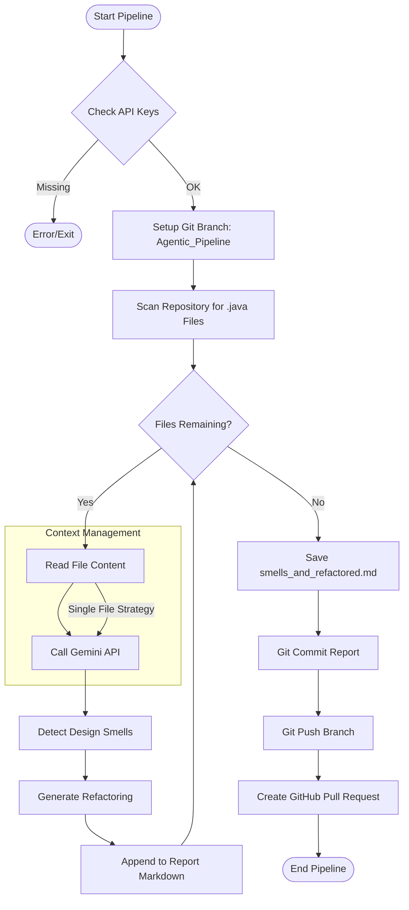

# Agentic Refactoring Pipeline Flowchart

```mermaid
flowchart TD
    Start([Start Pipeline]) --> EnvCheck{Check API Keys}
    EnvCheck -- Missing --> Err([Error/Exit])
    EnvCheck -- OK --> GitSetup[Setup Git Branch: Agentic_Pipeline]
    
    GitSetup --> Scan[Scan Repository for .java Files]
    Scan --> FileLoop{Files Remaining?}
    
    FileLoop -- Yes --> ReadFile[Read File Content]
    ReadFile --> GeminiAPI[Call Gemini API]
    GeminiAPI --> DetectSmells[Detect Design Smells]
    DetectSmells --> GenRefactor[Generate Refactoring]
    GenRefactor --> AppendReport[Append to Report Markdown]
    AppendReport --> FileLoop
    
    FileLoop -- No --> SaveReport[Save smells_and_refactored.md]
    SaveReport --> Commit[Git Commit Report]
    Commit --> Push[Git Push Branch]
    Push --> CreatePR[Create GitHub Pull Request]
    CreatePR --> End([End Pipeline])

    subgraph Context Management
    ReadFile -- Single File Strategy --> GeminiAPI
    end
```
