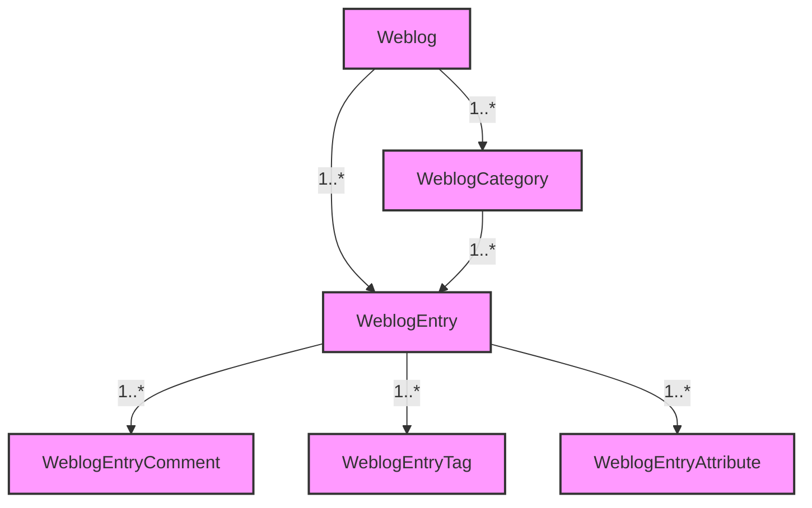

# Weblog and Content Subsystem Analysis

This document provides a detailed analysis of the Weblog and Content Subsystem in Apache Roller, specifically focusing on the `org.apache.roller.weblogger.business` and `org.apache.roller.weblogger.pojos` packages.

## 1. Key Classes

### Managers
*   **`WeblogEntryManager`**: The primary interface for managing weblog entries, comments, categories, and associated metadata.
*   **`WeblogManager`**: Handles the lifecycle of `Weblog` objects themselves.

### Implementations
*   **`JPAWeblogEntryManagerImpl`**: The JPA-based implementation of `WeblogEntryManager`. It uses `JPAPersistenceStrategy` for database operations.
*   **`JPAWeblogManagerImpl`**: The JPA-based implementation of `WeblogManager`.

### POJOs
*   **`Weblog`**: Represents a website/blog. It is the root object for the content subsystem.
*   **`WeblogEntry`**: Represents a single blog post.
*   **`WeblogEntryComment`**: Represents a comment on a blog post.
*   **`WeblogCategory`**: Organizes entries into categories.
*   **`WeblogEntryTag`**: Represents a tag applied to an entry.
*   **`WeblogEntryTagAggregate`**: Stores aggregate counts of tags for efficient querying.
*   **`WeblogHitCount`**: Tracks hit counts for weblogs.
*   **`WeblogEntryAttribute`**: Stores custom attributes for entries.

---

## 2. Recursive Trace of Methods

### `saveWeblogEntry(WeblogEntry entry)`
**Location**: `JPAWeblogEntryManagerImpl.java`

**Flow**:
1.  **Validation & Defaults**:
    *   Checks if `Category` is set. If not, defaults to `bloggerCategory` or the first available category.
    *   Checks if `Locale` is set. If not, defaults to the `Weblog`'s locale.
    *   Checks if `Anchor` is set. If not, calls `createAnchor(entry)` to generate a unique URL slug.
2.  **Tag Aggregation Updates**:
    *   **If Published**:
        *   If `refreshAggregates` is true (status changed to PUBLISHED): Increments tag counts for **all** tags using `updateTagCount`.
        *   Else: Increments tag counts only for **newly added** tags (`addedTags`).
    *   **If Not Published**:
        *   If `refreshAggregates` is true (status changed from PUBLISHED): Decrements tag counts for **all** tags.
    *   **Tag Removal**: Iterates over `removedTags` and calls `removeWeblogEntryTag` (which also decrements stats if the entry was published).
3.  **Future Publishing Check**:
    *   If status is `PUBLISHED` but `pubTime` is in the future (> 1 minute), changes status to `SCHEDULED`.
4.  **Persistence**:
    *   Updates `updateTime` to current time.
    *   Calls `strategy.store(entry)` to save to the database.
5.  **Side Effects**:
    *   **Weblog Update**: Calls `roller.getWeblogManager().saveWeblog(entry.getWebsite())` to update the weblog's `lastModified` date.
    *   **Ping Queue**: Calls `roller.getAutopingManager().queueApplicableAutoPings(entry)` to schedule pings (e.g., to search engines) if published.

**Internal Helper Methods**:
*   `createAnchor(WeblogEntry)`: Generates a unique anchor string.
*   `updateTagCount(name, website, amount)`: Updates `WeblogEntryTagAggregate` table.
*   `removeWeblogEntryTag(WeblogEntryTag)`: Removes a tag and updates stats.

**External Class Calls**:
*   `Weblogger.getWeblogManager()`
*   `Weblogger.getAutopingManager()`
*   `JPAPersistenceStrategy.store()`

### `getWeblogEntry`
**Location**: `JPAWeblogEntryManagerImpl.java`

**Variation 1: `getWeblogEntry(String id)`**
*   **Flow**: Directly calls `strategy.load(WeblogEntry.class, id)`.

**Variation 2: `getWeblogEntryByAnchor(Weblog website, String anchor)`**
*   **Flow**:
    1.  **Cache Lookup**: Checks `entryAnchorToIdMap` (Map<String, String>) for a hit using key `handle:anchor`.
    2.  **DB Lookup (if cache miss)**: Executes Named Query `WeblogEntry.getByWebsite&AnchorOrderByPubTimeDesc`.
    3.  **Cache Update**: Stores the result ID in `entryAnchorToIdMap`.

---

## 3. 'Heavily Used' (Hot) Methods

Based on cross-referencing and usage patterns, the **Top 3 Hot Methods** are:

| Rank | Method | Fan-In Count | Primary Callers |
|------|--------|--------------|-----------------|
| 1 | `getWeblogEntries(WeblogEntrySearchCriteria)` | **50+** | `PageModel`, `FeedServlet`, `Entries` (UI), `WeblogEntriesListPager`, `SiteModel`, `WeblogCalendarModel` |
| 2 | `getWeblogEntry(String id)` | **30+** | `EntryEdit`, `EntryRemove`, `CommentServlet`, `AddEntryOperation`, `PageServlet` |
| 3 | `saveWeblogEntry(WeblogEntry)` | **15+** | `EntryEdit`, `ScheduledEntriesTask`, `EntryCollection` (Atom API), `MetaWeblogAPIHandler` |

---

## 4. Connection Map

### Weblog (POJO)
*   **Contains**:
    *   `List<WeblogCategory>` (Categories)
    *   `List<WeblogBookmarkFolder>` (Bookmarks)
    *   `Map<String, WeblogEntryPlugin>` (Initialized Plugins)
*   **Relationships**:
    *   **One-to-Many** with `WeblogEntry` (Logic-level, accessed via Manager queries like `getRecentWeblogEntries`).
    *   **One-to-Many** with `WeblogCategory`.

### WeblogEntry (POJO)
*   **Contains**:
    *   `Set<WeblogEntryAttribute>`
    *   `Set<WeblogEntryTag>`
*   **Relationships**:
    *   **Many-to-One** with `Weblog` (`website` field).
    *   **Many-to-One** with `WeblogCategory` (`category` field).
    *   **One-to-Many** with `WeblogEntryComment` (accessed via `getComments()`, which delegates to `WeblogEntryManager`).

### WeblogEntryComment (POJO)
*   **Relationships**:
    *   **Many-to-One** with `WeblogEntry` (`weblogEntry` field).

### Visual Hierarchy


---

## 5. Recursive Connections (Indirect Dependencies)

This section documents how classes reach other classes through intermediary calls.

### `JPAWeblogEntryManagerImpl`
| Method | Calls | Which Calls |
|--------|-------|-------------|
| `saveWeblogEntry()` | `strategy.store(entry)` | `EntityManager.persist()` or `EntityManager.merge()` |
| `saveWeblogEntry()` | `roller.getWeblogManager().saveWeblog()` | `JPAWeblogManagerImpl.saveWeblog()` → `strategy.store()` |
| `saveWeblogEntry()` | `roller.getAutopingManager().queueApplicableAutoPings()` | `JPAAutoPingManagerImpl` → `strategy.store()` |
| `getWeblogEntry()` | `strategy.load()` | `EntityManager.find()` |
| `getWeblogEntries()` | `strategy.getDynamicQuery()` | `EntityManager.createQuery()` |

### `Weblog` (POJO)
| Method | Calls | Which Calls |
|--------|-------|-------------|
| `getCreator()` | `WebloggerFactory.getWeblogger().getUserManager().getUserByUserName()` | `JPAUserManagerImpl.getUserByUserName()` → `strategy.getNamedQuery()` |
| `getTheme()` | `WebloggerFactory.getWeblogger().getThemeManager().getTheme()` | `ThemeManagerImpl.getTheme()` |
| `getAbsoluteURL()` | `WebloggerFactory.getWeblogger().getUrlStrategy().getWeblogURL()` | `MultiWeblogURLStrategy.getWeblogURL()` |
| `getRecentWeblogEntries()` | `WebloggerFactory.getWeblogger().getWeblogEntryManager().getWeblogEntries()` | `JPAWeblogEntryManagerImpl.getWeblogEntries()` |
| `hasUserPermission()` | `WebloggerFactory.getWeblogger().getUserManager().checkPermission()` | `JPAUserManagerImpl.checkPermission()` |

### `WeblogEntry` (POJO)
| Method | Calls | Which Calls |
|--------|-------|-------------|
| `getCreator()` | `WebloggerFactory.getWeblogger().getUserManager().getUserByUserName()` | `JPAUserManagerImpl.getUserByUserName()` |
| `getComments()` | `WebloggerFactory.getWeblogger().getWeblogEntryManager().getComments()` | `JPAWeblogEntryManagerImpl.getComments()` → `strategy.getNamedQuery()` |
| `getPermalink()` | `WebloggerFactory.getWeblogger().getUrlStrategy().getWeblogEntryURL()` | `MultiWeblogURLStrategy.getWeblogEntryURL()` |
| `createAnchorBase()` | `WebloggerFactory.getWeblogger().getWeblogEntryManager().createAnchor()` | `JPAWeblogEntryManagerImpl.createAnchor()` |

### `WeblogCategory` (POJO)
| Method | Calls | Which Calls |
|--------|-------|-------------|
| `retrieveWeblogEntries()` | `WebloggerFactory.getWeblogger().getWeblogEntryManager().getWeblogEntries()` | `JPAWeblogEntryManagerImpl.getWeblogEntries()` |
| `isInUse()` | `WebloggerFactory.getWeblogger().getWeblogEntryManager().isWeblogCategoryInUse()` | `JPAWeblogEntryManagerImpl.isWeblogCategoryInUse()` |

---

## 6. Persistence Path: Entry to Database

The complete path from a `WeblogEntry` to the database is:

```
EntryEdit.save()
    └─→ WeblogEntryManager.saveWeblogEntry(entry)
            └─→ JPAWeblogEntryManagerImpl.saveWeblogEntry(entry)
                    └─→ JPAPersistenceStrategy.store(entry)
                            └─→ EntityManager.persist(entry) [NEW]
                            └─→ EntityManager.merge(entry)   [UPDATE]
                                    └─→ JPA Provider (EclipseLink/Hibernate)
                                            └─→ JDBC → Database
```
