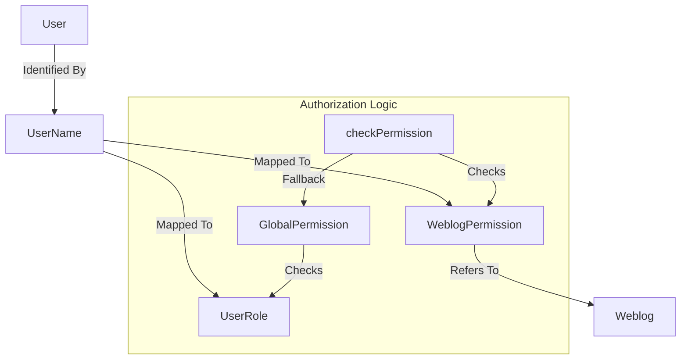

# User and Role Management Subsystem Analysis

This document analyzes the User and Role Subsystem in Apache Roller, focusing on `UserManager`, `JPAUserManagerImpl`, and the permission model.

## 1. Key Classes

*   **`UserManager`**: The business interface defining user, role, and permission management operations.
*   **`JPAUserManagerImpl`**: The concrete implementation using JPA for persistence.
*   **`User`**: The core authenticating entity.
*   **`UserRole`**: Represents a global role assigned to a user (e.g., "admin", "editor").
*   **`WeblogPermission`**: Represents permissions specific to a weblog (e.g., "post", "admin" on a specific blog).
*   **`GlobalPermission`**: Represents system-wide permissions derived from `UserRoles`.
*   **`ObjectPermission`**: Abstract base class for `WeblogPermission`.
*   **`RollerPermission`**: Abstract base class for all permission types.

---

## 2. Permission Check Methods

The central method for verifying permissions is defined in `UserManager` and implemented in `JPAUserManagerImpl`:

### `checkPermission(RollerPermission perm, User user)`
**Location**: `JPAUserManagerImpl.java`

This method acts as the single point of entry for authorization checks. Its logic flow is:

1.  **Weblog-Specific Check**:
    *   If the requested permission (`perm`) is an instance of `WeblogPermission`:
    *   It retrieves the user's existing permission for that specific weblog using `getWeblogPermission(weblog, user)`.
    *   It calls `existingPerm.implies(perm)` to see if the user's existing rights cover the requested action.
2.  **Global Check (Fall-through)**:
    *   If the specific weblog check fails (or wasn't applicable), it checks global permissions.
    *   It instantiates a `GlobalPermission(user)`.
    *   It calls `globalPerm.implies(perm)`. This allows global admins (users with the "admin" role) to perform actions on any weblog, as the `GlobalPermission` implementation logic usually implies all other permissions for admins.

---

## 3. Recursive Link Trace (Login/Authorization)

The connection between `User`, `UserRole`, and permission logic flows as follows:

1.  **User Identity**:
    *   A `User` is identified by `userName`.
2.  **Role Retrieval**:
    *   `UserRole` entities are linked to `User` by `userName`.
    *   `JPAUserManagerImpl.getRoles(user)` queries the `UserRole` table to find all roles (e.g., "admin", "editor") associated with the username.
3.  **Permission Evaluation**:
    *   When `checkPermission` creates a `GlobalPermission(user)`, that object internally inspects the user's roles.
    *   If the user has the "admin" `UserRole`, `GlobalPermission` returns `true` for `implies()`, granting full access.
4.  **Weblog Authorization**:
    *   For specific blog actions, `WeblogPermission` links a `User` to a `Weblog` (via `handle`) and a list of `actions` (e.g., EDIT_DRAFT, POST, ADMIN).
    *   The `implies()` logic in `WeblogPermission` handles hierarchy (e.g., ADMIN implies POST, POST implies EDIT_DRAFT).

**Visual Flow**:


---

## 4. 'Heavily Used' (Hot) Methods in JPAUserManagerImpl

Based on cross-referencing and usage patterns, the **Top 3 Hot Methods** are:

| Rank | Method | Fan-In Count | Primary Callers |
|------|--------|--------------|-----------------|
| 1 | `getUserByUserName(String)` | **40+** | `RollerUserDetailsService`, `UIAction`, `BaseAPIHandler`, `WeblogEntry.getCreator()`, `Weblog.getCreator()`, `MediaFile.getCreator()` |
| 2 | `checkPermission(RollerPermission, User)` | **25+** | `UISecurityInterceptor`, `MenuHelper`, `User.hasGlobalPermission()`, `WeblogEntry.canSave()`, `Weblog.hasUserPermission()` |
| 3 | `getWeblogPermission(Weblog, User)` | **15+** | `checkPermission()`, `Members` (UI), `MembersInvite`, `UIAction.requiredWeblogPermissions()` |

---

## 5. Dependency on JPAPersistenceStrategy

`JPAUserManagerImpl` delegates all actual persistence work to `JPAPersistenceStrategy`.

*   **Queries**: It uses `strategy.getNamedQuery()` for all retrievals (e.g., `User.getByUserName`, `UserRole.getByUserName`).
*   **CRUD**: It uses `strategy.store(Object)` and `strategy.remove(Object)` for saving users, roles, and permissions.
*   **Lazy Loading**: It relies on the strategy's `load(Class, id)` method for retrieving objects by ID.

This pattern decouples the business logic from the specific JPA `EntityManager` calls, allowing for a consistent persistence approach across the application.

---

## 6. Recursive Connections (Indirect Dependencies)

This section documents how classes reach other classes through intermediary calls.

### `JPAUserManagerImpl`
| Method | Calls | Which Calls |
|--------|-------|-------------|
| `getUserByUserName()` | `strategy.getNamedQuery("User.getByUserName")` | `EntityManager.createNamedQuery()` |
| `getUserByUserName()` | `strategy.load(User.class, id)` | `EntityManager.find()` |
| `checkPermission()` | `getWeblogPermission(weblog, user)` | `strategy.getNamedQuery("WeblogPermission.getByUserName&WeblogId")` |
| `checkPermission()` | `new GlobalPermission(user)` | `GlobalPermission` constructor calls `getUserManager().getRoles(user)` |
| `addUser()` | `strategy.store(newUser)` | `EntityManager.persist()` |
| `addUser()` | `grantRole("editor", newUser)` | `strategy.store(new UserRole(...))` |
| `saveUser()` | `strategy.store(user)` | `EntityManager.merge()` |

### `User` (POJO)
| Method | Calls | Which Calls |
|--------|-------|-------------|
| `hasGlobalPermission()` | `WebloggerFactory.getWeblogger().getUserManager().checkPermission()` | `JPAUserManagerImpl.checkPermission()` |
| `resetPassword()` | `RollerContext.getPasswordEncoder().encode()` | Spring Security `PasswordEncoder` |

### `GlobalPermission` (POJO)
| Method | Calls | Which Calls |
|--------|-------|-------------|
| Constructor | `WebloggerFactory.getWeblogger().getUserManager().getRoles(user)` | `JPAUserManagerImpl.getRoles()` → `strategy.getNamedQuery("UserRole.getByUserName")` |
| `implies()` | Checks if roles list contains "admin" | Internal logic |

### `WeblogPermission` (POJO)
| Method | Calls | Which Calls |
|--------|-------|-------------|
| `getWeblog()` | `WebloggerFactory.getWeblogger().getWeblogManager().getWeblogByHandle()` | `JPAWeblogManagerImpl.getWeblogByHandle()` |
| `getUser()` | `WebloggerFactory.getWeblogger().getUserManager().getUserByUserName()` | `JPAUserManagerImpl.getUserByUserName()` |

---

## 7. Cross-Subsystem Connections

The User Subsystem is used by nearly every other subsystem:

| Subsystem | Connection Point | Method Called |
|-----------|------------------|---------------|
| **Weblog Subsystem** | `Weblog.getCreator()` | `UserManager.getUserByUserName()` |
| **Weblog Subsystem** | `Weblog.hasUserPermission()` | `UserManager.checkPermission()` |
| **Weblog Subsystem** | `WeblogEntry.getCreator()` | `UserManager.getUserByUserName()` |
| **Weblog Subsystem** | `WeblogEntry.canSave()` | `UserManager.checkPermission()` |
| **Search Subsystem** | Indexing includes creator username | `WeblogEntry.getCreator().getUserName()` |
| **UI Layer** | `UISecurityInterceptor` | `UserManager.checkPermission()` |
| **UI Layer** | `RollerUserDetailsService` (Spring Security) | `UserManager.getUserByUserName()`, `UserManager.getRoles()` |

---

## 8. Authentication Path: Login to User Retrieval

The complete path from login to user retrieval is:

```
Spring Security Filter Chain
    └─→ RollerUserDetailsService.loadUserByUsername(username)
            └─→ WebloggerFactory.getWeblogger().getUserManager().getUserByUserName(username)
                    └─→ JPAUserManagerImpl.getUserByUserName(username)
                            └─→ Check userNameToIdMap cache
                            └─→ [CACHE MISS] strategy.getNamedQuery("User.getByUserName")
                                    └─→ EntityManager.createNamedQuery()
                                            └─→ JPA Provider → JDBC → Database
                            └─→ Update userNameToIdMap cache
                            └─→ Return User POJO
            └─→ UserManager.getRoles(user)
                    └─→ JPAUserManagerImpl.getRoles(user)
                            └─→ strategy.getNamedQuery("UserRole.getByUserName")
                                    └─→ Return List<UserRole>
            └─→ Construct RollerUserDetails (Spring UserDetails)
```
