# Apache Roller Architectural Analysis

> **Course**: CS6.401 Software Engineering - Project 1  
> **Purpose**: Architectural Mapping Report

---

## 1. Structural Overview

Apache Roller is a Java-based open-source blogging platform. The application follows a layered architecture with clear separation between the business tier, persistence layer, and presentation layer.

### 1.1 Package Organization


### 1.2 Weblog/Content Subsystem

| Component | Package | Description |
|-----------|---------|-------------|
| **WeblogEntryManager** | `business` | Interface defining weblog entry management operations |
| **JPAWeblogEntryManagerImpl** | `business.jpa` | JPA implementation of WeblogEntryManager (~1400 lines) |
| **WeblogManager** | `business` | Interface for weblog site management |
| **JPAWeblogManagerImpl** | `business.jpa` | JPA implementation of WeblogManager |
| **WeblogEntry** | `pojos` | Entity representing a blog post (~1000 lines) |
| **Weblog** | `pojos` | Entity representing a weblog site (~900 lines) |
| **WeblogCategory** | `pojos` | Entity for organizing entries into categories |
| **WeblogEntryComment** | `pojos` | Entity for comments on entries |
| **WeblogEntryTag** | `pojos` | Entity for tagging entries |

#### Key Classes in Weblog/Content Subsystem

- [WeblogEntryManager.java](file:///c:/Users/Saich/project-1-team-32/app/src/main/java/org/apache/roller/weblogger/business/WeblogEntryManager.java) - Interface (46 methods)
- [JPAWeblogEntryManagerImpl.java](file:///c:/Users/Saich/project-1-team-32/app/src/main/java/org/apache/roller/weblogger/business/jpa/JPAWeblogEntryManagerImpl.java) - Implementation (1394 lines)
- [WeblogEntry.java](file:///c:/Users/Saich/project-1-team-32/app/src/main/java/org/apache/roller/weblogger/pojos/WeblogEntry.java) - Entity (1031 lines)
- [Weblog.java](file:///c:/Users/Saich/project-1-team-32/app/src/main/java/org/apache/roller/weblogger/pojos/Weblog.java) - Entity (926 lines)

---

### 1.3 User/Role Subsystem

| Component | Package | Description |
|-----------|---------|-------------|
| **UserManager** | `business` | Interface defining user, role, and permission management |
| **JPAUserManagerImpl** | `business.jpa` | JPA implementation of UserManager |
| **User** | `pojos` | Entity representing a user account |
| **UserRole** | `pojos` | Entity representing user roles |
| **WeblogPermission** | `pojos` | Entity for weblog-level permissions |
| **GlobalPermission** | `pojos` | Entity for system-wide permissions |
| **RollerPermission** | `pojos` | Base class for permission objects |

#### Key Classes in User/Role Subsystem

- [UserManager.java](file:///c:/Users/Saich/project-1-team-32/app/src/main/java/org/apache/roller/weblogger/business/UserManager.java) - Interface (330 lines)
- [JPAUserManagerImpl.java](file:///c:/Users/Saich/project-1-team-32/app/src/main/java/org/apache/roller/weblogger/business/jpa/JPAUserManagerImpl.java) - Implementation (631 lines)
- [User.java](file:///c:/Users/Saich/project-1-team-32/app/src/main/java/org/apache/roller/weblogger/pojos/User.java) - Entity (278 lines)

---

### 1.4 Search/Indexing Subsystem

| Component | Package | Description |
|-----------|---------|-------------|
| **IndexManager** | `business.search` | Interface for full-text search operations |
| **LuceneIndexManager** | `business.search.lucene` | Lucene implementation of IndexManager |
| **IndexOperation** | `business.search.lucene` | Abstract base class for index operations |
| **AddEntryOperation** | `business.search.lucene` | Operation to add entry to index |
| **RemoveEntryOperation** | `business.search.lucene` | Operation to remove entry from index |
| **SearchOperation** | `business.search.lucene` | Operation to search the index |
| **RebuildWebsiteIndexOperation** | `business.search.lucene` | Operation to rebuild entire weblog index |

#### Key Classes in Search/Indexing Subsystem

- [IndexManager.java](file:///c:/Users/Saich/project-1-team-32/app/src/main/java/org/apache/roller/weblogger/business/search/IndexManager.java) - Interface (77 lines)
- [LuceneIndexManager.java](file:///c:/Users/Saich/project-1-team-32/app/src/main/java/org/apache/roller/weblogger/business/search/lucene/LuceneIndexManager.java) - Implementation (486 lines)
- [IndexOperation.java](file:///c:/Users/Saich/project-1-team-32/app/src/main/java/org/apache/roller/weblogger/business/search/lucene/IndexOperation.java) - Abstract base class (212 lines)

---

## 2. Design Patterns Identified

### 2.1 Service/Manager Pattern (Façade)

The **Manager/Service pattern** is the primary architectural pattern used throughout Apache Roller.


**Location**: 
- Interface: [Weblogger.java](file:///c:/Users/Saich/project-1-team-32/app/src/main/java/org/apache/roller/weblogger/business/Weblogger.java)
- Implementation: [WebloggerImpl.java](file:///c:/Users/Saich/project-1-team-32/app/src/main/java/org/apache/roller/weblogger/business/WebloggerImpl.java)

---

### 2.2 Factory Pattern (with Provider)

The **Factory Pattern** is implemented via `WebloggerFactory` which uses a configurable `WebloggerProvider` to instantiate the business tier.

```java
// From WebloggerFactory.java lines 57-63
public static Weblogger getWeblogger() {
    if (webloggerProvider == null) {
        throw new IllegalStateException("Roller Weblogger has not been bootstrapped yet");
    }
    return webloggerProvider.getWeblogger();
}
```

**Location**: [WebloggerFactory.java](file:///c:/Users/Saich/project-1-team-32/app/src/main/java/org/apache/roller/weblogger/business/WebloggerFactory.java)

---

### 2.3 Data Access Object (DAO) Pattern

The persistence layer uses **JPA-based DAO pattern** with `JPAPersistenceStrategy` as the central data access layer.


**Location**: [JPAPersistenceStrategy.java](file:///c:/Users/Saich/project-1-team-32/app/src/main/java/org/apache/roller/weblogger/business/jpa/JPAPersistenceStrategy.java)

---

### 2.4 Strategy Pattern

#### 2.4.1 URL Strategy

The **Strategy Pattern** is used for URL generation, allowing different URL formats based on configuration.

```mermaid
classDiagram
    class URLStrategy {
        <<interface>>
        +getWeblogURL(Weblog, String, boolean)
        +getWeblogEntryURL(Weblog, String, String, boolean)
        +getPreviewURLStrategy(String) URLStrategy
    }
    
    class AbstractURLStrategy {
        <<abstract>>
        #absoluteContextURL: String
        #relativeContextURL: String
    }
    
    class MultiWeblogURLStrategy {
        +getWeblogURL()
        +getWeblogEntryURL()
    }
    
    class PreviewURLStrategy {
        -previewTheme: String
        +getWeblogURL()
    }
    
    URLStrategy <|.. AbstractURLStrategy
    AbstractURLStrategy <|-- MultiWeblogURLStrategy
    AbstractURLStrategy <|-- PreviewURLStrategy
```



**Location**: 
- [URLStrategy.java](file:///c:/Users/Saich/project-1-team-32/app/src/main/java/org/apache/roller/weblogger/business/URLStrategy.java)
- [MultiWeblogURLStrategy.java](file:///c:/Users/Saich/project-1-team-32/app/src/main/java/org/apache/roller/weblogger/business/MultiWeblogURLStrategy.java)

#### 2.4.2 Index Operation Strategy (Command Pattern)

Search indexing uses a **Command/Strategy hybrid** with `IndexOperation` as the base.


**Location**: [IndexOperation.java](file:///c:/Users/Saich/project-1-team-32/app/src/main/java/org/apache/roller/weblogger/business/search/lucene/IndexOperation.java)

---

### 2.5 Plugin Pattern

Weblog entry rendering uses a **Plugin Pattern** for extensible text transformation.

```java
// WeblogEntryPlugin.java - Interface for entry text plugins
public interface WeblogEntryPlugin {
    String getName();
    String getDescription();
    void init(Weblog weblog) throws WebloggerException;
    String render(WeblogEntry entry, String str);
}
```

**Implementations**:
- `ConvertLineBreaksPlugin` - Converts line breaks to HTML
- `EncodePreTagsPlugin` - Encodes content within pre tags
- `ObfuscateEmailPlugin` - Hides email addresses from spam bots
- `SmileysPlugin` - Converts text emoticons to images

**Location**: [WeblogEntryPlugin.java](file:///c:/Users/Saich/project-1-team-32/app/src/main/java/org/apache/roller/weblogger/business/plugins/entry/WeblogEntryPlugin.java)

---

### 2.6 Dependency Injection (via Google Guice)

Apache Roller uses **Google Guice** for dependency injection throughout the business tier.

```java
// Example from JPAWeblogEntryManagerImpl.java
@com.google.inject.Singleton
public class JPAWeblogEntryManagerImpl implements WeblogEntryManager {
    
    @com.google.inject.Inject
    protected JPAWeblogEntryManagerImpl(Weblogger roller, JPAPersistenceStrategy strategy) {
        this.roller = roller;
        this.strategy = strategy;
    }
}
```

**Location**: [JPAWebloggerModule.java](file:///c:/Users/Saich/project-1-team-32/app/src/main/java/org/apache/roller/weblogger/business/jpa/JPAWebloggerModule.java)

---

## 3. Design Smells

> [!WARNING]
> The following design smells were identified in the `org.apache.roller.weblogger.business` package and related areas.

### 3.1 God Class: `JPAWeblogEntryManagerImpl`

| Metric | Value |
|--------|-------|
| **File** | [JPAWeblogEntryManagerImpl.java](file:///c:/Users/Saich/project-1-team-32/app/src/main/java/org/apache/roller/weblogger/business/jpa/JPAWeblogEntryManagerImpl.java) |
| **Lines of Code** | ~1,394 |
| **Number of Methods** | 52+ |
| **Responsibilities** | WeblogEntry CRUD, WeblogCategory CRUD, Comments CRUD, Tags management, Hit counts, Statistics |

**Evidence**:
```java
// This single class handles multiple distinct concerns:
- saveWeblogEntry(), removeWeblogEntry(), getWeblogEntry()  // Entry management
- saveWeblogCategory(), removeWeblogCategory()              // Category management  
- saveComment(), removeComment(), getComments()             // Comment management
- updateTagCount(), getPopularTags()                        // Tag management
- incrementHitCount(), resetHitCount()                      // Analytics
- getCommentCount(), getEntryCount()                        // Statistics
```

**Recommendation**: Extract separate managers for:
- `CommentManager` - Handle all comment operations
- `TagManager` - Handle tag aggregation and statistics
- `AnalyticsManager` - Handle hit counts and statistics

---

### 3.2 God Class: `WeblogEntry` Entity

| Metric | Value |
|--------|-------|
| **File** | [WeblogEntry.java](file:///c:/Users/Saich/project-1-team-32/app/src/main/java/org/apache/roller/weblogger/pojos/WeblogEntry.java) |
| **Lines of Code** | ~1,031 |
| **Number of Fields** | 20+ |
| **Number of Methods** | 80+ |

**Evidence**:
This entity class violates Single Responsibility Principle by containing:
- Persistence data and JPA annotations
- Business logic (e.g., `getCommentsStillAllowed()`)
- Presentation logic (e.g., `formatPubTime()`, `getRss09xDescription()`)
- URL generation helpers (e.g., `getPermalink()`, `getPermaLink()`)
- Tag management logic

```java
// Lines 632-664 - Business logic embedded in entity
public boolean getCommentsStillAllowed() {
    if (!WebloggerRuntimeConfig.getBooleanProperty("users.comments.enabled")) {
        return false;
    }
    // ... complex date calculation logic
}

// Lines 679-690 - Presentation logic in entity
public String formatPubTime(String pattern) {
    SimpleDateFormat format = new SimpleDateFormat(pattern, ...);
    return format.format(getPubTime());
}
```

**Recommendation**: 
- Move presentation logic to dedicated `WeblogEntryFormatter` utility
- Move business rules to service layer (`WeblogEntryManager`)
- Keep entity as an anemic POJO with only data and relationships

---

### 3.3 Deep Inheritance: `IndexOperation` Hierarchy

| Metric | Value |
|--------|-------|
| **Inheritance Depth** | 3 levels |
| **Location** | `org.apache.roller.weblogger.business.search.lucene` |


**Evidence**: The hierarchy creates tight coupling where changes to base classes ripple through all descendants.

**Recommendation**: Consider using composition with strategy objects instead of deep inheritance.

---

### 3.4 Feature Envy: `WeblogEntry.getCreator()`

| Metric | Value |
|--------|-------|
| **File** | [WeblogEntry.java](file:///c:/Users/Saich/project-1-team-32/app/src/main/java/org/apache/roller/weblogger/pojos/WeblogEntry.java) |
| **Lines** | 246-253 |

**Evidence**:
```java
// Lines 246-253 - Entity reaches into service layer
public User getCreator() {
    try {
        return WebloggerFactory.getWeblogger().getUserManager()
            .getUserByUserName(getCreatorUserName());
    } catch (Exception e) {
        mLogger.error("ERROR fetching user object for username: " + getCreatorUserName(), e);
    }
    return null;
}
```

The entity class is reaching into the service layer (`WebloggerFactory`) to fetch related data. This violates proper layering and creates hidden dependencies.

**Recommendation**: Use lazy-loading JPA relationship or have the service layer populate this field.

---

### 3.5 Shotgun Surgery Risk: Comments in Multiple Locations

**Evidence**: Comments functionality is scattered across:
- `WeblogEntry.getComments()` - Entity method fetching comments
- `JPAWeblogEntryManagerImpl.saveComment()` - Persistence
- `JPAWeblogEntryManagerImpl.removeComment()` - Removal
- `JPAWeblogEntryManagerImpl.getComments()` - Query
- `IndexOperation.getDocument()` - Search indexing includes comment content

Any change to comment behavior requires modifications in 5+ locations.

**Recommendation**: Create a dedicated `CommentManager` interface and implementation.

---

## 4. Key Flow: WeblogEntry from Manager to Database

### 4.1 Saving a WeblogEntry

The following diagram illustrates how a `WeblogEntry` flows from the `WeblogEntryManager` to the database:


### 4.2 Code Walkthrough

**Step 1-5: Validation and Preparation** (Lines 182-236 of `JPAWeblogEntryManagerImpl`)

```java
public void saveWeblogEntry(WeblogEntry entry) throws WebloggerException {
    // Ensure category is set
    if (entry.getCategory() == null) {
        WeblogCategory cat = entry.getWebsite().getBloggerCategory();
        if (cat == null) {
            cat = entry.getWebsite().getWeblogCategories().iterator().next();
        }
        entry.setCategory(cat);
    }

    // Ensure locale is set
    if (entry.getLocale() == null) {
        entry.setLocale(entry.getWebsite().getLocale());
    }
    
    // Create unique anchor if needed
    if (entry.getAnchor() == null || entry.getAnchor().isBlank()) {
        entry.setAnchor(this.createAnchor(entry));
    }
    
    // Update tag aggregates for published entries
    if (entry.isPublished()) {
        // ... tag count updates
    }
    
    // Convert PUBLISHED to SCHEDULED for future dates
    if (PubStatus.PUBLISHED.equals(entry.getStatus()) &&
            entry.getPubTime().after(new Date(System.currentTimeMillis() + MIN_IN_MS))) {
        entry.setStatus(PubStatus.SCHEDULED);
    }
```

**Step 6-7: Persistence** (Lines 239-241)

```java
    // Set update timestamp
    entry.setUpdateTime(new Timestamp(new Date().getTime()));
    
    // Store to database via JPA
    this.strategy.store(entry);
```

**Step 8-9: Post-Save Operations** (Lines 243-251)

```java
    // Update weblog last modified date
    if(entry.isPublished()) {
        roller.getWeblogManager().saveWeblog(entry.getWebsite());
    }
    
    // Queue applicable pings for this update
    if(entry.isPublished()) {
        roller.getAutopingManager().queueApplicableAutoPings(entry);
    }
}
```

### 4.3 JPAPersistenceStrategy.store() Implementation

The `store()` method (Lines 171-178 of `JPAPersistenceStrategy`):

```java
public Object store(Object obj) throws WebloggerException {
    EntityManager em = getEntityManager(true);  // Gets thread-local EM with transaction
    if (!em.contains(obj)) {
        // If entity is not managed we can assume it is new
        em.persist(obj);
    }
    return obj;
}
```

### 4.4 Transaction Management

Transactions are managed via `JPAPersistenceStrategy`:

1. **Begin**: `getEntityManager(true)` starts transaction if not active
2. **Persist**: EntityManager tracks changes  
3. **Flush/Commit**: `flush()` method commits transaction
4. **Release**: `release()` method rolls back uncommitted changes and closes EM

---

## 5. Summary

### Architecture Strengths

| Aspect | Description |
|--------|-------------|
| **Clear Layering** | Separation between business, persistence, and presentation |
| **Interface-based** | All managers defined as interfaces with JPA implementations |
| **Dependency Injection** | Uses Guice for loose coupling |
| **Extensibility** | Plugin system for entry rendering |
| **Search Integration** | Decoupled Lucene indexing via Command pattern |

### Areas for Improvement

| Issue | Severity | Location |
|-------|----------|----------|
| God Class | High | `JPAWeblogEntryManagerImpl`, `WeblogEntry` |
| Feature Envy | Medium | `WeblogEntry.getCreator()` |
| Mixed Concerns in Entities | Medium | Presentation logic in POJOs |
| Deep Inheritance | Low | `IndexOperation` hierarchy |

---

*Generated for CS6.401 Software Engineering - Project 1*
